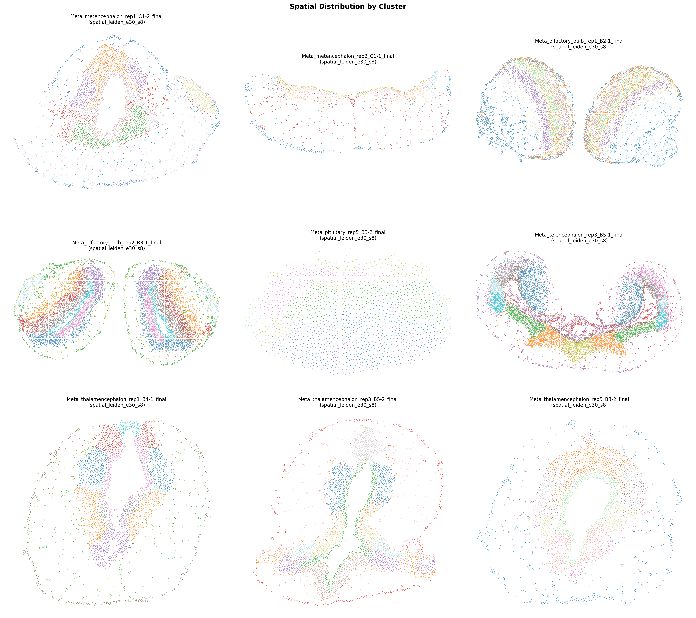

# Metalotl 🦎

[](https://www.python.org/downloads/)
[](https://shiny.posit.co/py/)

An interactive Shiny application for exploring spatial transcriptomics data from the metamorphosed axolotl brain.

## 📋 Overview

Metalotl provides an interactive web interface to explore spatial gene expression data from metamorphosed axolotl brain regions, including:

| Brain Region | Replicates |
|--------------|------------|
| 🧠 Metencephalon (hindbrain) | 2 |
| 👃 Olfactory bulb | 2 |
| 🔴 Pituitary | 1 |
| 🧩 Telencephalon (forebrain) | 1 |
| 🔷 Thalamencephalon (diencephalon) | 3 |

[](spatial_clusters.pdf)

## ✨ Features

- **Spatial visualization** — spot-level gene expression in spatial coordinates
- **UMAP projection** — 2D UMAP with cluster overlays, pre-computed for all datasets
- **Cluster overlays** — Leiden clustering, structure annotation, or Seurat clusters
- **Gene expression overlay** — per-gene expression mapped to both UMAP and spatial plots
- **G2M cell-cycle score** — computed on demand from canonical marker genes, shown on both plots
- **Annotated gene names** — AMEX gene IDs mapped to Axolotl Tanaka annotations
- **Fast loading** — full in-memory cache with mtime-based invalidation; gene choices pre-built per file

---

## 🚀 Installation

### Requirements
- Python 3.12 or higher
- [conda](https://docs.conda.io/) or [mamba](https://mamba.readthedocs.io/) (recommended)

### Setup

```bash
# Create and activate environment
mamba create -n metalotl python=3.12
mamba activate metalotl

# Clone the repository
git clone --branch main https://github.com/SebastianBohm/Metalotl.git
cd Metalotl

# Install the package
pip install -e .
```

---

## 📊 Data Setup

### Required Files

Place the processed `.h5ad` files and the annotation CSV in `data/`:

```
data/
├── Meta_metencephalon_rep1_DP8400015649BR_C1-2_final.h5ad
├── Meta_metencephalon_rep2_DP8400015649BR_C1-1_final.h5ad
├── Meta_olfactory_bulb_rep1_DP8400015234BL_B2-1_final.h5ad
├── Meta_olfactory_bulb_rep2_DP8400015234BL_B3-1_final.h5ad
├── Meta_pituitary_rep5_DP8400015234BL_B3-2_final.h5ad
├── Meta_telencephalon_rep3_DP8400015234BL_B5-1_final.h5ad
├── Meta_thalamencephalon_rep1_DP8400015234BL_B4-1_final.h5ad
├── Meta_thalamencephalon_rep3_DP8400015234BL_B5-2_final.h5ad
├── Meta_thalamencephalon_rep5_DP8400015234BL_B3-2_final.h5ad
└── Adult_meta_DGE_markers.csv
```

Each `.h5ad` file must contain:
- `adata.obsm['spatial']` — spot coordinates
- `adata.obsm['X_umap']` — 2D UMAP (run `scripts/precompute_umap.py` if missing)
- A clustering column in `adata.obs` (`spatial_leiden_e30_s8`, `structure`, or `seurat_clusters`)

### Pre-computing UMAP

If the h5ad files don't yet have `X_umap`, run once:

```bash
mamba activate metalotl
python scripts/precompute_umap.py
```

---

## 🖥️ Running the App

### Local Machine

```bash
mamba activate metalotl
python -m shiny run src/metalotl/app.py
```

Open your browser at **http://localhost:8000**

### Remote Server

1. Connect with port forwarding:
```bash
ssh -L 12345:localhost:8000 username@server
```

2. On the server:
```bash
mamba activate metalotl
cd Metalotl
python -m shiny run src/metalotl/app.py --port 8000
```

3. Open locally at **http://localhost:12345**

---

## 🎮 Usage Guide

1. **Select a dataset** from the dropdown — the app auto-discovers all `_final.h5ad` files in `data/`
2. **Choose a clustering** resolution (Leiden, Structure annotation, or Seurat clusters)
3. **Toggle cluster colours** with the "Show clusters" switch
4. **Search for a gene** — the dropdown is filtered to genes present in the selected dataset, with annotated names
5. **Plot expression** — enable "Plot gene expression" to overlay expression on both UMAP and spatial plots
6. **G2M score** — enable "Show G2M score" to visualise cell-cycle activity
7. **Adjust dot sizes** with the UMAP and Space sliders independently

---

## 📁 Project Structure

```
Metalotl/
├── data/                       # H5AD data files + annotation CSV
├── scripts/
│   └── precompute_umap.py      # One-time UMAP pre-computation script
├── src/metalotl/
│   ├── app.py                  # Shiny app entry point
│   ├── _constants.py           # Dataset discovery, gene annotations, G2M genes
│   ├── fct/
│   │   ├── load.py             # Data loading with in-memory mtime cache
│   │   ├── spatial_widget.py   # Spatial plot (clusters + expression)
│   │   └── umap_widget.py      # UMAP plot (clusters + expression + G2M)
│   ├── js/
│   │   └── _format.py          # Selectize dropdown formatting
│   └── mod/
│       ├── server.py           # Shiny reactive server logic
│       └── ui.py               # Shiny UI layout
├── setup.py
├── pyproject.toml
└── README.md
```

---

## 📈 QC Summary

| Sample | Brain Region | Median Genes | Median UMIs | Cells |
|--------|-------------|-------------:|------------:|------:|
| Meta_olfactory_bulb_rep1_…B2-1 | olfactory_bulb | 1,062 | 1,146 | 5,370 |
| Meta_olfactory_bulb_rep2_…B3-1 | olfactory_bulb | 1,821 | 2,127 | 5,989 |
| Meta_telencephalon_rep3_…B5-1 | telencephalon | 1,083 | 1,110 | 6,669 |
| Meta_thalamencephalon_rep1_…B4-1 | thalamencephalon | 1,589 | 1,805 | 3,013 |
| Meta_thalamencephalon_rep3_…B5-2 | thalamencephalon | 864 | 913 | 3,537 |
| Meta_thalamencephalon_rep5_…B3-2 | thalamencephalon | 959 | 1,065 | 2,524 |
| Meta_metencephalon_rep1_…C1-2 | metencephalon | 1,191 | 1,436 | 3,219 |
| Meta_metencephalon_rep2_…C1-1 | metencephalon | 515 | 566 | 1,167 |
| Meta_pituitary_rep5_…B3-2 | pituitary | 856 | 931 | 1,641 |

---

## 🙏 Acknowledgments

- **Adnan** for the template
- **Mateja** for discovering the data
